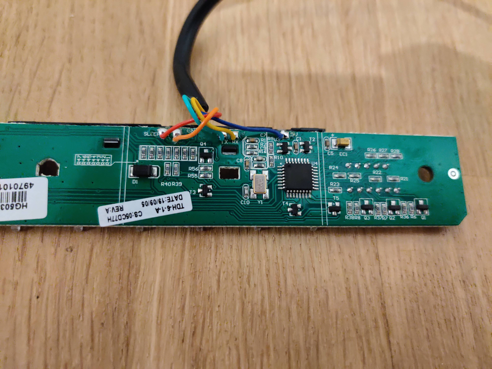
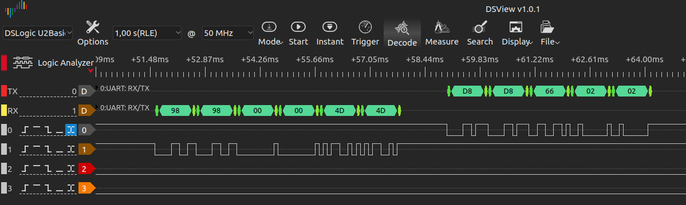

# Autonomous Standup Desk Controller

**This writeup is still WIP**

## The Idea

I bought a standing desk from Autonomous (Smart Desk 2 Home Office). After setting it up, I was wondering how the controller and the table/motor controller communicate with each other.

## ToDo

- More detailed writeup
- Finish implementing protocol on ESP32 (possibly with wifi control, "full system" in the future?)

## First impressions

Opening up the controller reveals nicely labeled PINs.



Thus we now only know that UART is used to transfer data, but also which wire carries which signal:

| color  | function |
| ------ | -------- |
| red    | sleep(?) |
| orange | GND      |
| green  | TX       |
| yellow | RX       |
| blue   | 5V       |

After some trying out, I found the baudrate: 9600

Height-Profiles are not saved on this controller - they are stored in the desk.

The controller board uses a STC12C5612AD controller. It features:

- 3,5-5,5V
- 8 Bit
- 23 I/O pins
- 1x UART
- 768 Bytes RAM
- 4K-30 KB program memory size (according to datasheet)

[Datasheet](https://www.datasheet4u.com/datasheet-pdf/STC/STC12C5612AD/pdf.php?id=853205)

## My Setup

I used a DSView Logic Analyzer which I bought here [from Banggood](https://www.banggood.com/DSLogic-Logic-Analyzer-16-Channels-400M-Sampling-USB-based-Debugging-Logic-Analyzer-p-1200454.html).

I did not dismantle the controller that shipped with my desk. Instead, I asked the customer support for a spare one / replacement. They shipped it to me for 27€.

I opened up the casing (standard screws) and found a nicely labeled PCB where I could attach the probes to. 

You can find my captured data from the logic analyzer in the folder "logic_analyzer".

## My controller implementation

**_If you are only interested in reading about the protocol, skip this part and scroll down._**

The general setup is easy. You need to include these two header files:

```cpp
#include "hw_interface/uart_device.h"
#include "app/autonomous_controller.h"
```

Now you can prepare the controller:

```cpp
//create an object that handles the uart connection
//we use UART_NUM_2 and the pins 23 + 22
uart_device uart(UART_NUM_2, 9600, 23, 22);

//create an autonomous controller (it needs the uart handler)
//if the uart is configured differently, the construcor
//will automatically set baudrate, data and stop bits
autonomous_controller controller(&uart);
```

You are all good to go. Now you can move your desk up and down (provided you have all the wires hooked up correctly). Some examples:

```cpp
#move the desk to the height value 0x4D
#note: I might add a conversion in the future so you can
#use logical units such as cm
controller.go_to_height(0x4D);

#the same as when you press the button "1"
#	->move to the saved preset height
controller.go_to_preset(controller.button_1);

#pretend you are pressing buttons 1 and 2 simultaniously
#I don't know why you might want to do that...
controller.send_button(controller.button_1 | controller.button_2);

#move the table down 1 step
#you can use both commands - they do the same
controller.go_down();
controller.send_button(controller.button_down);

#...
#please have a look at the file autonomous_controller.h for more details
```

## Protocol

### Received Data

When no button is pressed, we keep receiving (repeating):

Base Message:

| Byte 0 | Byte 1 | Byte 2 | Byte 3 | Byte 4   | Byte 5   |
| ------ | ------ | ------ | ------ | -------- | -------- |
| 0x98   | 0x98   | 0x00   | 0x00   | (height) | (height) |
| 0x98   | 0x98   | 0x03   | 0x03   | (height) | (height) |

Height can be a value between *0x4B* and *0x7B*

I am not really sure about the meaning of 0x03 as byte 2+3. I have mostly seen 0x00, but sometimes also 0x03.


Height indication:

Height: 29.05

Last 2 Bytes of Message: 0x4B, 0x4B


Height: 29.09

Last 2 Bytes of Message: 0x4C, 0x4C


Height: 30.03

Last 2 Bytes of Message: 0x4D, 0x4D


Height keeps increasing in steps of 0.4
Message keeps increasing by 1
...


Height: 48.00

Last 2 Bytes of Message: 0x7A, 0x7A


Height: 48.40

Last 2 Bytes of Message: 0x7B, 0x7B

### Transmitted Data

Base message:

| Byte 0 | Byte 1 | Byte 2 | Byte 3   | Byte 4   |
| ------ | ------ | ------ | -------- | -------- |
| 0xD8   | 0xD8   | 0x66   | (button) | (button) |

Button values:

:arrow_down: 0x01 (0b0000_0001)

:arrow_up: 0x02 (0b0000_0010)

:one: 0x04 (0b0000_0100)

:two: 0x08 (0b0000_1000)

:three: 0x10 (0b0001_0000)

:four: 0x20 (0b0010_0000)

:m: 0x40 (0b0100_0000)


#### Pressing up

0xD8, 0xD8, 0x66, 0x00, 0x00

0xD8, 0xD8, 0x66, 0x02, 0x02

(keep going with end 0x02 as long as the button is pressed)

#### Pressing Down

0xD8, 0xD8, 0x66, 0x00, 0x00

0xD8, 0xD8, 0x66, 0x02, 0x01

(keep going with end 0x01 as long as the button is pressed)

#### Pressing 1

0xD8, 0xD8, 0x66, 0x00, 0x00

0xD8, 0xD8, 0x66, 0x04, 0x04

(keep going with end 0x04 as long as the button is pressed)

#### Pressing 2

0xD8, 0xD8, 0x66, 0x00, 0x00

0xD8, 0xD8, 0x66, 0x08, 0x08

(keep going with end 0x08 as long as the button is pressed)

#### Pressing 3

0xD8, 0xD8, 0x66, 0x00, 0x00

0xD8, 0xD8, 0x66, 0x10, 0x10

(keep going with end 0x10 as long as the button is pressed)

#### Pressing 4

0xD8, 0xD8, 0x66, 0x00, 0x00

0xD8, 0xD8, 0x66, 0x00, 0x20

(keep going with end 0x20 as long as the button is pressed)

#### Pressing M

0xD8, 0xD8, 0x66, 0x00, 0x00

0xD8, 0xD8, 0x66, 0x40, 0x40

(keep going with end 0x40 as long as the button is pressed)

### Analyzing the protocol

- Controller->Desk: Every message contains 5 bytes
- Controller->Desk: Message always starts with 0xD8, 0xD8, 0x66
- Controller->Desk: Last 2 Bytes always repeat
- Desk->Controller: Every message contains 6 bytes
- Desk->Controller always starts with 0x98, 0x98, 0x00, 0x00
- Every button corresponds to 1 bit in the message

  - 7 buttons, 8 bit -> highest bit unused (?)
- The controller sends the current state of the buttons after receiving a message from the desk
- The controller seems to only move as long as it is receiving data (0x00 as button-data seems to be enough)
- Messages are sent every ~50ms


